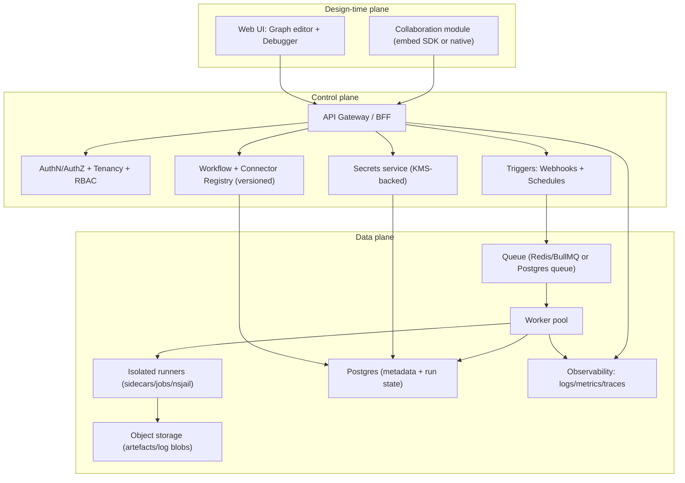
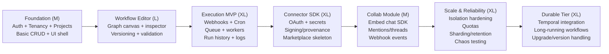

# Building a workflow automation web app inspired by n8n and app.weavy.ai

## Executive summary

Level, the strongest “through-line” across best-in-class workflow builders is a **three-plane architecture**: a *design-time plane* (graph editor + collaboration), a *control plane* (auth, tenancy, scheduling, webhooks, versioning, secrets), and a *data plane* (isolated execution workers, queues, and durable state). n8n’s queue mode (main instance + Redis broker + workers + DB) is a canonical example of separating “UI/control” from “execution” so the editor stays responsive under load. citeturn7search1

For a small-but-serious product, the safest practical baseline is:

- **Queue-based orchestration** (Postgres + Redis + worker pool) with **strong isolation** for any user-supplied code and third‑party connector code, mirroring patterns used by Activepieces (app + workers + sandbox + engine; Postgres + Redis/BullMQ) and Windmill (stateless API servers and workers pulling jobs from a Postgres queue; sandboxing with nsjail). citeturn23view0turn22search5  
- **Designed-for-migration execution semantics**: keep an internal “workflow IR” (intermediate representation) so you can later swap the runtime under the hood (e.g., moving critical long-running workflows to Temporal, as Retool does for workflows and agents). citeturn20view0  
- **Security-first extensibility**: treat connectors/plugins as a supply-chain surface. The n8n ecosystem has experienced real-world attacks via malicious community nodes masquerading as legitimate integrations, and n8n has had sandbox-escape vulnerabilities in its Python execution model (with patched mitigations). citeturn1search22turn13search3turn13search1

Where you can differentiate:

- Provide **two “execution tiers”**: fast path (queue workers) for short tasks + durable path (Temporal or equivalent) for multi-day workflows and high-reliability business processes, aligned with durable execution concepts (crash-proof execution) described by Temporal. citeturn9search9turn4search2  
- Make collaboration a **pluggable subsystem**: embed an SDK (TalkJS, Stream, Sendbird, Twilio) for chat/activity/commenting in the MVP, while keeping an escape hatch to build deeper real-time collaboration later (CRDT/OT fundamentals). citeturn5search3turn15view0turn14search2turn14search0turn9search2turn9search27

## Problem statement and scope

### Curated problem statement

Build a web application that:

- Lets users **compose node-based workflows** in a browser (like n8n’s editor and the node-based canvas positioning of entity["company","Figma Weave","ai workflow tool"] from `app.weavy.ai` / `weave.figma.com`). citeturn2search1turn2search17turn2search14  
- Runs workflows **reliably at scale**, including: webhooks, schedules, retries, fan-out/fan-in, and long-running waits (n8n explicitly supports queue mode and concurrency controls; it also publishes performance benchmarks). citeturn7search1turn7search0turn18view1  
- Supports a connector ecosystem (first-party + third-party) with **safe auth patterns** (OAuth, API keys) and **safe distribution** (signing/provenance, review). citeturn3search4turn3search0turn7search3  
- Offers (or can embed) **in-app collaboration** primitives (chat/comments/activity feeds/files), comparable to SDK-first messaging/collaboration vendors and toolkits. citeturn5search11turn15view0turn14search0turn14search2

### In-scope capability tiers

MVP scope (small but complete):

- Graph editor, workflow CRUD, execution history, logs, and basic debugging.
- Webhook + schedule triggers.
- Core connector set (HTTP, auth helpers, webhooks, CRUD on a few “anchor” apps).
- Pluggable secrets/credentials with encryption and audit trail.

Scale scope:

- Multi-tenant isolation, quotas, sharding strategy for executions/logs.
- “Bring your own workers” / on-prem connectivity.
- Marketplace + signed connectors + dependency/provenance rules.
- High-grade observability and incident response.

## Comparable platforms and what to learn from them

### Curated landscape map

The table below groups platforms by the *dominant thing they’re “selling”*: orchestration/runtime, low-code app building, or embeddable collaboration.

| Category | Platform | What to learn | URL |
|---|---|---|---|
| Workflow automation / iPaaS | entity["company","Zapier","automation saas"] | “Apps” model (triggers/actions) + OAuth integration builder and CLI workflow for partner apps. citeturn3search8turn3search12turn3search0 | `https://zapier.com/` |
| Workflow automation / iPaaS | entity["company","Make","automation platform"] | “Scenario” UX + webhooks + developer APIs for building app capabilities (SDK apps, webhook configuration). citeturn3search1turn3search5 | `https://www.make.com/` |
| Workflow automation for devs | entity["company","Pipedream","serverless workflow platform"] | Serverless runtime + code steps in multiple languages + component registry (sources/actions) and built-in concurrency/throttling. citeturn3search2turn3search6turn3search10turn3search29 | `https://pipedream.com/` |
| Enterprise iPaaS | entity["company","Workato","enterprise integration platform"] | Enterprise connector SDK and secure hybrid connectivity via on-prem agent patterns. citeturn3search3turn3search30turn3search27 | `https://www.workato.com/` |
| Open-source automation | entity["organization","Activepieces","open-source automation"] | Clean separation: app + worker + sandbox + engine; explicit scaling guidance and queue-based reliability. citeturn23view0 | `https://www.activepieces.com/` |
| Open-source workflow engine | entity["company","Windmill","open-source workflow engine"] | Postgres-queue execution model + Rust performance + strong sandboxing posture + explicit stack disclosure. citeturn22search5turn22search0 | `https://www.windmill.dev/` |
| Flow-based automation | entity["organization","Node-RED","flow-based programming tool"] | Node palette ecosystem + governance controls for installing external modules; flow readability challenges and tooling like linters. citeturn8search0turn8search16turn8search17 | `https://nodered.org/` |
| Orchestration (batch/data) | entity["organization","Apache Airflow","workflow orchestration"] | Scheduler/executor architecture + metadata DB patterns; good reference architecture diagrams. citeturn4search3turn4search11 | `https://airflow.apache.org/` |
| Durable execution engine | entity["company","Temporal","durable workflow engine"] | Durable execution semantics + horizontally scalable workers; a “runtime you don’t rebuild” approach. citeturn4search2turn9search9 | `https://temporal.io/` |
| Microservice orchestration | entity["organization","Netflix Conductor","workflow orchestration"] | Worker-task queue orchestration model; architecture doc explicitly describes worker polling. citeturn8search27turn8search11 | `https://conductor-oss.org/` |
| BPMN/process automation | entity["company","Camunda","process orchestration vendor"] | Self-managed cluster reference architectures and IAM composition (Keycloak/Identity). citeturn8search2turn8search6 | `https://camunda.com/` |
| Low-code internal apps | entity["company","Appsmith","open-source internal tools"] | “Fat container” deployment trade-offs; explicit component list; user-centric ops simplification. citeturn21view0turn6search0 | `https://www.appsmith.com/` |
| Low-code internal apps | entity["company","Budibase","open-source low-code platform"] | Multi-service self-host architecture: CouchDB + MinIO + Redis + NGINX; per-app DB partitioning. citeturn19view0turn6search5 | `https://budibase.com/` |
| Low-code internal apps | entity["company","Retool","low-code internal tools"] | Self-hosted distributed containers; Temporal-powered workflow execution and separate code executor. citeturn20view0 | `https://retool.com/` |
| Low-code internal apps | entity["company","ToolJet","open-source low-code platform"] | OSS baseline for internal tools + workflow + integrations positioning (less architectural disclosure than peers). citeturn6search10turn6search2 | `https://tooljet.com/` |
| Embeddable collaboration | entity["company","Weavy","in-app collaboration sdk"] | Componentised “UIKit” approach (web components / React bindings) + API-first embedding posture. citeturn0search18turn2search8 | `https://www.weavy.com/` |
| Chat/feeds API | entity["company","Stream","getstream chat api"] | High-scale real-time system design; public benchmark methodology + edge network model. citeturn15view0 | `https://getstream.io/chat/` |
| Chat platform | entity["company","Sendbird","in-app chat platform"] | Multi-SDK support + explicit rate-limits guidance; plan-based throttling realities. citeturn5search9turn14search2turn14search9 | `https://sendbird.com/` |
| Messaging API | entity["company","Twilio","communications api vendor"] | Clear hard limits (participants, conversations per identity) + lifecycle tools (states/timers) to manage limits. citeturn14search0turn14search6turn14search11 | `https://www.twilio.com/docs/conversations` |
| Embeddable chat | entity["company","TalkJS","embeddable chat sdk"] | “Embed-first” UX; webhooks as an integration backbone; permissions via roles. citeturn5search3turn5search7turn5search11 | `https://talkjs.com/` |
| Node-based creative workflows | entity["company","Figma","collaborative design platform"] (via Figma Weave) | Credits-based monetisation; multi-model “workflow canvas” positioning; separate product with planned deeper integration. citeturn2search5turn2search0turn2search17 | `https://weave.figma.com/` |

image_group{"layout":"carousel","aspect_ratio":"16:9","query":["n8n queue mode architecture diagram redis worker","Activepieces architecture diagram app worker sandbox engine","Appsmith deployment architecture diagram single docker container","Stream chat benchmark 5 million users chart"] ,"num_per_query":1}

## Architectures, tech stacks, and deployment patterns observed

### Reference patterns that repeat across winners

**Pattern: Separate “workflow authoring” from “workflow execution”.**  
n8n’s queue mode formalises this separation: the main instance handles timers and webhooks, enqueues execution IDs into Redis, and worker instances pull jobs and load workflow data from the database. citeturn7search1 Activepieces expresses a very similar split: “App” (API + scheduling) and “Worker” (polling jobs), plus a dedicated “Sandbox” that hosts the execution engine. citeturn23view0

**Pattern: Treat execution as hostile.**  
n8n’s “task runners” are explicitly designed to execute user-provided JavaScript and Python in a “secure and performant” way, with “internal mode not recommended for production” and “external mode” running as separate containers for stronger isolation. citeturn12search2turn12search1turn12search9 Windmill similarly calls out sandboxing (nsjail / PID namespace isolation) in its published stack. citeturn22search5

**Pattern: A queue or event log mediates load spikes.**  
Activepieces handles webhook spikes by validating and enqueueing, then processing via workers polling the queue. citeturn23view0 Workato’s hybrid model introduces an on-prem agent so execution can happen inside a protected environment while still coordinating from cloud. citeturn3search30turn3search7

**Pattern: Durable execution becomes a separate decision.**  
Temporal is positioned around “durable execution” (crash-proof execution), with horizontally scalable workers via SDKs. citeturn9search9turn4search2 Retool self-hosting documents Temporal as a central distributed system for scheduling and running async tasks for workflows and agents, decoupled from its code executor service. citeturn20view0

### Platform-by-platform extraction table

This table is intentionally strict: **if the stack is not publicly disclosed in primary sources, it’s marked unknown**.

| Platform | Public architecture diagram or description | Public tech stack signals | Deployment pattern | Integration/connectors approach |
|---|---|---|---|---|
| n8n | Queue mode steps: main (timers/webhooks) → Redis broker → workers → DB. citeturn7search1 Benchmarks published (single + multi-instance). citeturn18view1 | GitHub language mix: TypeScript + Vue. citeturn11view0 DB via TypeORM; default SQLite; supports Postgres; MySQL/MariaDB deprecated. citeturn12search3turn12search11turn12search0 | Single instance “regular mode” and multi-instance “queue mode”; concurrency env var exists. citeturn7search0turn7search12 | “Nodes” + credentials files; community nodes can be installed; verification guidelines include provenance requirement effective **May 1, 2026**. citeturn7search11turn7search3turn1search32 |
| Zapier | Integration-building concept docs (architecture framing + Visual Builder + CLI). citeturn3search8turn3search12 | Stack not publicly detailed in official docs used here. (Unknown) | SaaS, multi-tenant (typical). | “Apps” made of triggers/actions with auth models including OAuth v2. citeturn3search37turn3search0turn3search4 |
| Make | Webhooks features and constraints documented; SDK Apps webhook APIs exist. citeturn3search5turn3search1 | Stack not publicly detailed in the sources used here. (Unknown) | SaaS, multi-tenant (typical). | Scenario modules + webhooks; developer APIs for app webhook management. citeturn3search5turn3search1 |
| Pipedream | Positions as “serverless runtime and workflow service”; workflows support code steps in Node.js/Python/Go/Bash; built-in concurrency/throttling; VPC support is referenced. citeturn3search2turn3search6turn3search29 | Multi-language code steps strongly imply polyglot runtime support; internal infra stack not fully disclosed here. | SaaS/serverless (no servers to manage). citeturn3search6 | “Components” model: sources (triggers) and actions; publish privately or to registry. citeturn3search10turn3search18 |
| Workato | On-prem agent documentation + on-prem API rate limits. citeturn3search30turn3search27 | Connector SDK (DSL) documented; internal stack not disclosed here. citeturn3search3turn3search11 | SaaS multi-tenant + hybrid via on-prem agent installed in customer network. citeturn3search30turn3search7 | Pre-built connectors + “Connector SDK” for custom connectors. citeturn3search3turn3search11 |
| Activepieces | Explicit architecture: App, Worker, Sandbox (resource limits + lifecycle), Engine; Postgres + Redis/BullMQ. citeturn23view0 | TypeScript monorepo; UI React; API Fastify; Redis queue BullMQ. citeturn23view0turn4search0 | Self-hostable; scale by replicating app/workers and sizing DB; queue smooths spikes. citeturn23view0 | “Pieces” package contains triggers/actions for third-party apps. citeturn23view0 |
| Windmill | OpenFlow spec + workflow architecture docs; execution model described as flows in OpenFlow format. citeturn22search0turn22search1 | Explicit stack: Postgres DB; Rust backend (stateless API servers + workers pulling jobs from Postgres queue); Svelte 5 frontend; nsjail sandboxing; multi runtimes. citeturn22search5 | OSS self-host + SaaS; design encourages horizontal scaling due to stateless servers and worker pool. citeturn22search5 | Scripts/flows as core artefacts; integrations documented (e.g., Postgres integration). citeturn22search8turn22search0 |
| Node-RED | Node palette + flow structure docs; runtime config can restrict external modules. citeturn8search0turn8search16turn8search4 | Project is open-source; built on Node.js (ecosystem), per repository and docs context. citeturn8search1turn8search9 | Commonly single-tenant (self-host edge/IoT); can be containerised. | Nodes installed from a catalogue / npm; Manage Palette; can lock down external modules. citeturn8search0turn8search16 |
| Apache Airflow | Architecture doc enumerates scheduler / executor concept; older docs show metadata DB and diagram. citeturn4search3turn4search11 | Python ecosystem (implicit in Airflow); primary source here focuses on components, not internals. citeturn4search3 | Usually self-hosted single-tenant per deployment; scales via executors/workers. | Integrations largely via operators/hooks; DAG-as-code model (not node-graph). citeturn4search3 |
| Temporal | Temporal SDKs provide client + worker APIs; platform explains durable execution and horizontally scalable workers. citeturn4search2turn9search9 | Server is open source; major language SDKs exist; detailed infra is outside this extraction. citeturn4search17turn4search14 | Self-host or Temporal Cloud; multi-tenant via namespaces (Temporal concept). citeturn9search13turn20view0 | Tasks executed by worker processes written in general-purpose languages. citeturn4search2turn4search14 |
| Netflix Conductor | Architecture doc: worker-task queue model; workers poll queues; runtime model diagram is referenced. citeturn8search27turn8search11 | Stack varies; Conductor describes architecture, not a fixed “full stack” here. | Self-hosted orchestration engine; typically single-tenant. | Workers implemented externally; orchestration via server scheduling model. citeturn8search27 |
| Appsmith | Explicit deployment architecture: single Docker container encapsulating Java backend, NGINX, realtime service, MongoDB, Redis; includes diagram; discusses upgrade pain and process manager choice. citeturn21view0 | Java backend + NGINX + MongoDB + Redis + RTS (Node.js) inside one container; Supervisor for process mgmt. citeturn21view0 | Single-container “modular monolith” for ease; Kubernetes support recommended for production. citeturn6search0turn21view0 | Integrations to data sources/services are product-level features; connector internals not detailed here. citeturn21view0 |
| Budibase | Self-hosted architecture: app service + worker service + CouchDB (replication/partitioning; per-app DB separation) + MinIO + NGINX + Redis; apps built with Svelte. citeturn19view0 | CouchDB primary DB; Redis caching and sessions; MinIO object store; Svelte for apps. citeturn19view0 | Multi-service self-host; consistent architecture across hosting methods. citeturn19view0 | Provides automations and external connectors; integrates with other automation platforms. citeturn19view0 |
| Retool | Self-hosted architecture: distributed containers; separate code executor; Temporal cluster for workflow orchestration; scaling rules (replicate api/workers; don’t replicate jobs-runner). citeturn20view0 | Explicitly uses Temporal for workflows/agents; Postgres platform DB; code-executor-service image. citeturn20view0 | Self-hosted within VPN/VPC; enterprise plan; container-based microservices-ish layout. citeturn20view0turn6search27 | Connects to “resources” (APIs/DBs); execution via Temporal workers + code executor. citeturn20view0 |
| Stream | Public scale claims and internals: edge network; benchmark for 5M concurrent users; Go backend; Redis-intensive caching and cluster; AWS infra; test suites and smoketests. citeturn15view0 | Go backend; Redis usage; web sockets; edge TLS termination; AWS hosting stated. citeturn15view0turn5search12 | SaaS multi-tenant; global edge. citeturn15view0 | SDKs + UI components; webhooks and migration guides; rate limits and API budgeting concepts exist. citeturn15view0 |
| Sendbird | SDK + Platform API; explicit rate-limit docs and plan-based quotas. citeturn5search1turn14search2turn14search9 | Stack not fully disclosed here; focus is SDK support. | SaaS multi-tenant. | SDKs (client) + REST Platform API; rate-limiting enforced. citeturn5search17turn14search2 |
| Twilio Conversations | Hard limits documented: 1000 participants / conversation; 1000 active+inactive conversations per identity; lifecycle “states and timers” to manage the limit. citeturn14search0turn14search6turn14search11 | Stack not disclosed here (SaaS API). | SaaS multi-tenant. | REST API + SDKs; costs and identity semantics matter for billing and limits. citeturn14search11turn14search21 |
| TalkJS | Webhooks + roles docs; marketing claims for security posture (TLS 1.3, encryption) and SLA tiers. citeturn5search3turn5search7turn5search11 | Stack not disclosed here (SaaS embed). | SaaS multi-tenant. | Embed widget + webhooks + REST APIs for back-end control. citeturn5search3turn5search19 |
| Figma Weave | Node-based “AI-powered design workflows” positioning; product is standalone today; pricing is credit-based. citeturn2search1turn2search17turn2search0 | Stack not disclosed. | SaaS. | Integrations centred on “multi-model” workflow canvas; specifics not disclosed in sources used here. citeturn2search1turn2search0 |

## Benchmarks, limits, security gaps, and UX pain points

### Performance and scalability indicators you can actually use

A recurring problem in workflow platforms is confusing “marketing scale” with “engineering scale”. These are the most concrete, transferable indicators from primary sources:

- n8n publishes a benchmark claiming **up to 220 workflow executions per second on a single instance**, with scaling by adding instances; it also provides a benchmarking framework for estimating your own use case. citeturn18view1  
- Stream claims it can **connect 5 million users to the same channel** with **sub‑40ms latency**, and discloses a detailed architecture: Go backend, edge servers, extensive caching with Redis cluster, AWS hosting, and repeatable benchmarking. citeturn15view0  
- Twilio Conversations documents firm limits: **1000 participants per conversation** and **1000 active+inactive conversations per identity**, plus lifecycle controls to close conversations so they don’t count toward the limit. citeturn14search0turn14search6  
- Make documents webhook constraints (e.g., **5MB payload** cap and a **180-second** response timeout, regardless of subscription tier, in the referenced webhook documentation). citeturn3search5  
- Workato documents **60 requests per minute** rate limit for on-prem API endpoints (for that API surface). citeturn3search27  
- Sendbird documents rate limits that vary by plan and quota and provides default per-user rate-limit examples (e.g., message send rate). citeturn14search2turn14search9

**Interpretation for your design:** aim to define three standard QoS envelopes from day one:

1. **Interactive** (human-in-the-loop, seconds): UI responsiveness, fast debugging, clear partial runs.  
2. **Operational** (minutes): “business automations” with retries, idempotency guidance, and safe secrets handling.  
3. **Durable** (hours–months): workflow state survives crashes and redeploys, matching durable execution goals. citeturn9search9

### Common security gaps and loopholes, with real examples

**Supply-chain risk through connectors/plugins is not theoretical.**  
A documented supply-chain attack targeted the n8n community node ecosystem via a malicious npm package that impersonated a Google Ads integration and exfiltrated credentials. citeturn1search22 n8n’s response trajectory includes stronger verification practices (notably a stated requirement for publishing community nodes via GitHub Actions and including provenance statements starting May 1, 2026). citeturn7search3

**Sandbox boundaries tend to fail unless they are “structural,” not “best-effort.”**  
n8n’s Python Code Node (Pyodide-based) had a published sandbox bypass (CVE-2025-68668) enabling arbitrary command execution as the n8n process for authenticated users who can modify workflows; patching involved moving toward task-runner-based isolation (default in 2.0.0 per advisory). citeturn13search3turn13search1 This is a direct warning that “workflow builders” become “RCE builders” if code execution is not isolated.

**Configuration foot-guns are a recurring issue in self-hosted products.**  
Retool’s trust centre documents a host header injection scenario in self-hosted deployments missing a specific BASE_DOMAIN environment variable, with remediation by setting that variable and later versions requiring it. citeturn6search35 n8n explicitly warns that self-hosting mistakes can lead to security issues and downtime and recommends self-hosting only for expert users. citeturn12search12

**“Secrets via environment variables” is still surprisingly common and leaky.**  
In n8n Embed configuration, credential overwrites via environment variables are explicitly described as possible but “not recommended” because “environment variables aren’t protected” and can leak. citeturn7search14

### UX and developer-experience pain points that show up everywhere

**Graph editors scale poorly without “maintainability primitives”.**  
Node-RED’s own design work explicitly calls out that flows can become hard to understand (e.g., unnamed function nodes, too many nodes), motivating linting/readability tooling. citeturn8search17 The lesson: if your app succeeds, users will create unreadable graphs unless you enforce conventions and supply refactoring/navigation tools.

**Queue-mode reliability and “distributed debugging” are hard.**  
n8n queue mode has reported issues in the wild (examples: “execution cancel” doesn’t stop the task; sporadic queue-worker errors after upgrades). citeturn0search36turn26view2 Even when these are edge cases, the product lesson is stable: once execution is distributed, you must invest in *correlation IDs, traceability, and deterministic replays*.

**Deployment UX matters as much as product UX.**  
Appsmith’s architecture write-up is essentially a case study in “deployment complexity kills adoption”: moving from multiple containers to a single container improved the installation experience, and they cite very low success rates with the earlier approach. citeturn21view0 Budibase similarly documents a multi-service architecture with an ingress proxy and shared dependencies, emphasising consistency across self-host methods. citeturn19view0

## Concrete recommendations for your app

### Target architecture options and trade-offs

Think of this as choosing your *execution substrate*.

| Option | What it looks like | Strengths | Costs / risks | Best fit |
|---|---|---|---|---|
| Queue-first runtime (recommended MVP) | “Main/control” service + Redis/BullMQ queue + worker pool; workflow state in Postgres; isolated sidecars for code steps. Mirrors n8n queue mode and Activepieces’ app/worker/sandbox split. citeturn7search1turn23view0 | Fast to build; intuitive mapping to node graphs; great for short/medium workflows; simple horizontal scaling (add workers); familiar debugging model (logs per step). | Durable multi-day workflows need careful persistence; retries/idempotency become your responsibility; cancellation semantics are subtle (n8n shows pitfalls). citeturn0search36 | n8n-like automation, internal tools, webhooks + cron |
| Durable-execution runtime | Temporal cluster + workers; your product is “workflow IDE + registry + runtime control”. Retool uses Temporal for workflows; Temporal frames this as durable execution/crash-proof. citeturn20view0turn9search9 | Best-in-class reliability for long-running flows; timers/retries/worker failover are core features; strong operational model for critical business processes. | Higher conceptual complexity (determinism constraints, workflow versioning); harder to keep “pure no-code”; more infra. | High-reliability business workflows; regulated operations |
| DB-queue / FSM runtime | Postgres as queue + state transitions via DB transactions (Windmill model). citeturn22search5turn22search3 | Fewer moving parts than Redis + queue; strong transactional semantics; good performance with careful schema. | DB becomes hot path; needs careful indexing/partitioning; heavy write load can become bottleneck. | Script-heavy internal automation; “self-hosted lambda” feel |

**Recommendation:** build **Queue-first** with a clean runtime interface so you can later support a **Durable tier** for selected workflows (not everything). This mirrors how Retool externalises durable workflow execution into Temporal and separates a code-executor service. citeturn20view0

### Suggested tech stacks

#### MVP stack (fast iteration, strong community tooling)

A pragmatic MVP that aligns with successful open-source implementations:

- **Frontend:** React + TypeScript (graph editor + inspector panels). Activepieces uses React for UI. citeturn23view0  
- **Backend/API:** TypeScript + Fastify (or NestJS) + OpenAPI; Activepieces uses Fastify for its API package. citeturn23view0  
- **DB:** Postgres as source of truth for tenants/workflows/executions (Activepieces; Windmill; n8n supports Postgres). citeturn23view0turn22search5turn18view1  
- **Queue:** Redis + BullMQ (or equivalent). Activepieces explicitly uses Redis to power the queue via BullMQ. citeturn23view0  
- **Sandboxing:** container-per-run (Kubernetes jobs) or sidecar runners; follow n8n’s “external task runner” principle for isolation. citeturn12search1turn12search2  
- **Observability:** OpenTelemetry traces + Prometheus metrics endpoint; n8n shows a Prometheus /metrics approach. citeturn1search25

#### Scale stack (throughput + isolation + multi-runtime strengths)

If you expect heavy code execution, many languages, or high concurrency:

- **Backend/core runtime:** Rust (Windmill’s approach) or Go (Stream uses Go for chat backend). citeturn22search5turn15view0  
- **Frontend:** Svelte or React; Windmill uses Svelte 5. citeturn22search5  
- **Isolation:** nsjail / gVisor / Firecracker (depending on threat model); Windmill explicitly calls out nsjail and PID namespace isolation. citeturn22search5  
- **Durable tier:** Temporal for critical workflows (as Retool does). citeturn20view0

### Data model considerations that prevent “death by logs”

A workflow platform’s database typically collapses under **execution history + step outputs + binary blobs** unless you plan retention and storage tiers early. n8n directly exposes execution pruning intervals and a concurrency production limit as configuration, and also documents that it stores workflows/credentials/executions in its database. citeturn7search12turn12search26turn1search23

Minimum “serious” data model (conceptual):

- **Tenancy:** tenant → workspace/project → user memberships + roles.
- **Workflows:** workflow → versions (immutable) → nodes/edges config (JSON) + secrets references.
- **Connectors:** connector definition → auth schema → credential instances (encrypted) + token refresh metadata.
- **Runs:** execution/run → step runs → logs/events → artefact pointers (S3/Blob storage).
- **Triggers:** webhook endpoints (unique URLs + secret) and schedules.

Operational guardrails:

- Configurable **retention policy** for execution data (time-based + count-based), and a two-phase delete (soft then hard) to avoid DB locks, similar to n8n’s pruning controls. citeturn7search12turn1search39  
- Separate “hot” vs “cold” logs (hot in DB for recent debugging; cold in object storage).

### Connector/plugin model

You need to decide whether connectors run **in-process**, **in a shared runtime**, or **out-of-process**.

Given documented supply-chain attacks in automation ecosystems, treat connectors as potentially malicious. citeturn1search22 A robust connector model for your app would include:

- **Connector packaging:** signed bundles with a provenance statement (n8n is moving toward provenance requirements for community nodes). citeturn7search3  
- **Execution boundary:**  
  - *Safe connectors* (pure HTTP, deterministic transforms) may run in a shared “connector runner” with tight egress allowlists.  
  - *Risky connectors* (custom code, npm dependencies, headless browsers) must run out-of-process with resource constraints.

- **Policy engine:** allow admins to block specific connectors/nodes (n8n supports blocking nodes as a hardening measure). citeturn13search3turn12search12  
- **Auth patterns:** first-class OAuth handling (Zapier’s Platform emphasises OAuth v2 guidance) and secure token storage/refresh. citeturn3search0turn3search4

### Orchestration engine choices

If you stay queue-first, your internal engine must correctly handle:

- retries with backoff,
- idempotency keys,
- partial re-runs,
- fan-out/fan-in,
- and “wait until event or time”.

Temporal gives you a lot of this by design, and the durable execution framing is that state is captured in a way that survives crashes. citeturn9search9turn4search2 A 2022 paper framing the orchestration case notes that orchestration provides a controller coordinating services, and evaluates workflow engines as an approach for microservices orchestration. citeturn9search3turn9search31

### Collaboration layer strategy

You have two plausible MVP directions:

- **Embed-first (recommended MVP):** integrate an embeddable chat/collaboration SDK and treat it as a module. TalkJS provides webhooks for event notifications; Twilio/Sendbird provide explicit limits/rate limits; Stream provides an extreme-scale architecture baseline. citeturn5search3turn14search0turn14search2turn15view0  
- **Build-first (later):** if you need shared document editing (not just chat), you’ll eventually be choosing between OT and CRDT models. CRDTs provide convergence guarantees under eventual consistency models. citeturn9search2turn9search27

### Proposed target architecture

## Migration, compatibility, monetisation, roadmap, and risk management

### Migration and compatibility strategy

1. **Workflow import/export as a stable contract.**  
   Use a versioned JSON schema for workflows, with a “migration tool” step when schema evolves (n8n has explicit migration/breaking-change concepts in release notes). citeturn13search8

2. **Compatibility adapters, not “perfect clones.”**  
   If you want to attract n8n users, build an importer that:
   - reads n8n’s graph JSON,
   - maps node types to your connector equivalents,
   - and flags unmapped nodes as “manual intervention required”.
   
   This avoids the trap of re-implementing n8n’s internal semantics (including its security foot-guns).

3. **Connector portability:** define a minimal connector interface that can wrap:
   - REST + OAuth services (Zapier-style),
   - webhook-driven sources (Make-style),
   - code-based components (Pipedream-style). citeturn3search37turn3search5turn3search6

### Monetisation models seen in the wild

- **Credits/usage-based:** Figma Weave uses credits per month in its pricing. citeturn2search0turn2search12  
- **Hard limits + per-user billing:** Twilio ties identities and activity to billing, and documents how identities become “active users”. citeturn14search11  
- **Platform/enterprise licensing for self-hosting:** Retool’s self-hosting is enterprise-only. citeturn20view0  
- **Paid embedding/white-labelling:** n8n Embed and white labelling are explicitly tied to licensing. citeturn7search6turn7search2

Concrete monetisation options for *your* app:

- **SaaS tiers**: charge by (runs/month) + concurrency + retention window + premium connectors.
- **Enterprise**: self-host licence + on-prem agent + SCIM/SAML + audit logs.
- **Marketplace**: rev share on paid connectors/templates.
- **Embed licence**: charge for embedding workflow builder or collaboration components into third-party products.

### Prioritised roadmap with effort/complexity levels

Effort is expressed as a rough **engineering complexity** (S/M/L/XL) and typical dependencies. Treat it as a planning heuristic, not a promise.

Recommended sequencing (high-level):

- First ship a usable workflow builder with **one** execution model (queue-first) and **~10 excellent connectors**, not 200 mediocre ones.
- Add “collaboration as an add-on” early because it accelerates adoption (comments, approvals, human handoff), but keep it pluggable.
- Invest in connector signing/provenance before you open a public marketplace (n8n’s ecosystem experience shows why). citeturn1search22turn7search3

### Key risks and mitigations

1. **Connector supply-chain compromise**  
   - *Risk:* malicious packages / impersonated connectors. citeturn1search22  
   - *Mitigation:* signed connectors + provenance; curated allowlist by default; sandbox connector execution; continuous scanning.

2. **Sandbox escape / RCE through code steps**  
   - *Risk:* workflow editors become execution surfaces; n8n’s CVE history is a clear caution. citeturn13search3turn13search1  
   - *Mitigation:* external runners by default; strict egress; default-deny imports; separate privileges; per-tenant isolation.

3. **Operational instability in distributed execution**  
   - *Risk:* cancellations, retries, and worker scale-down edge cases. citeturn0search36turn26view2  
   - *Mitigation:* adopt idempotency keys; “at-least-once” semantics with explicit dedupe; graceful worker lifecycle; end-to-end tracing.

4. **Graph sprawl and unmaintainable workflows**  
   - *Risk:* unreadable flows as users scale. citeturn8search17  
   - *Mitigation:* linting, node naming rules, subflows/modules, dependency graphs, environment promotion workflows.

5. **Database bloat from execution histories**  
   - *Risk:* runaway storage costs and degraded performance. citeturn7search12turn1search23  
   - *Mitigation:* retention policies, cold storage, step output truncation, separate blob store for binaries.

6. **Vendor lock-in and portability backlash**  
   - *Risk:* users demand exportability and self-host paths.  
   - *Mitigation:* stable export schema; “connector portability boundary”; optional self-host packaging (Helm + Docker Compose) with strong defaults.

